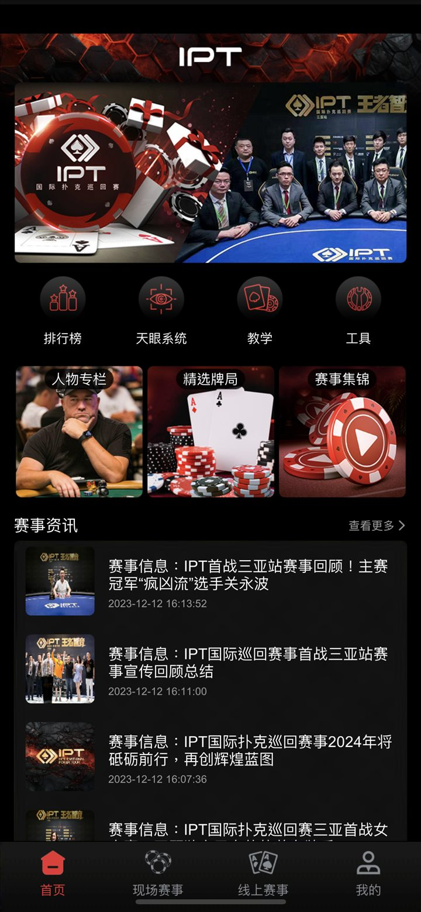
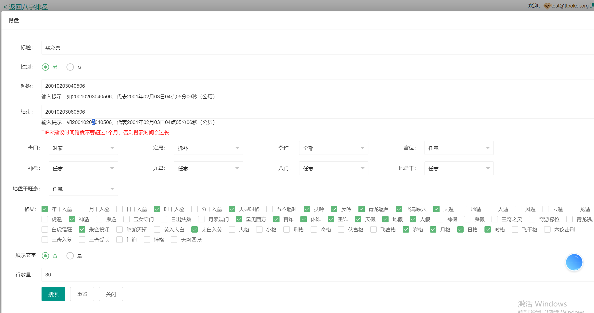

# alibabama401 源码作品集

**简体中文** · [繁體中文](README.zh-TW.md) · [English](README.en.md) · [图文网站](https://alibabama401.github.io/alibabama401/)

 源码作品集，覆盖扑克平台、德州俱乐部、 德州积分大厅 、捕鱼源码、IM通讯系统及传统周易排盘文化 Web 工具。

## 项目

| Repository | Description |
| --- | --- |
| [Texas-Holdem-Online-Poker-Platform](https://github.com/alibabama401/Texas-Holdem-Online-Poker-Platform) | 德州扑克在线大厅|德州积分大厅 |
| [Texas-Holdem-Poker-Platform-Source-Code](https://github.com/alibabama401/Texas-Holdem-Poker-Platform-Source-Code) | 德州扑克源码 |德州俱乐部|德州私人局|
| [Texas-Hold-em-Tournament-Source-Code](https://github.com/alibabama401/Texas-Hold-em-Tournament-Source-Code) | 德州扑克赛事平台 |
| [Fishing-Game-Complete-Source-Art](https://github.com/alibabama401/Fishing-Game-Complete-Source-Art) | 捕鱼游戏源码与美术 |
| [Fishing-Game-Numeric-Copywriting](https://github.com/alibabama401/Fishing-Game-Numeric-Copywriting) | 捕鱼游戏数值与文案 |
| [Arcade-Game-Hall-Source-Code](https://github.com/alibabama401/Arcade-Game-Hall-Source-Code) | 街机游戏大厅源码 |
| [Card-Game-Platform-Source-Code](https://github.com/alibabama401/Card-Game-Platform-Source-Code) | 棋牌游戏平台源码 |
| [Mahjong-Game-Hall-Source-Code](https://github.com/alibabama401/Mahjong-Game-Hall-Source-Code) | 麻将游戏大厅源码 |
| [Source-Code-for-Instant-Messaging-IM-Office-Chat-System](https://github.com/alibabama401/Source-Code-for-Instant-Messaging-IM-Office-Chat-System) | 即时通讯与办公聊天源码 |
| [I-Ching-BaZi-Complete-Source](https://github.com/alibabama401/I-Ching-BaZi-Complete-Source) | 周易排盘与八字 Web 应用源码 |

## 产品、玩法与技术方向

- **扑克：** 德州在线平台（德州积分大厅）、德州俱乐部、德州私人局、德州锦标赛与赛事内容。
- **游戏大厅：** 捕鱼、街机、棋牌、麻将，以及美术与数值资料。
- **应用系统：** 即时通讯、办公聊天、周易与八字 Web 工具。
- **项目检索：** 描述性仓库名称、截图、多语言页面与可搜索分类。

## 产品截图

*德州扑克经典牌桌与玩法配置*

*德州积分大厅多桌锦标赛界面*

*德州私人牌桌与德州俱乐部创建界面*

*扑克赛事首页与资讯界面*

*捕鱼游戏大厅与玩法选择*

*八字排盘查询界面*

*传统文化排盘界面*

## Keywords

德州扑克源码 ·德州源码 ·  德州俱乐部·  扑克赛事源码 · 捕鱼游戏源码 · 棋牌游戏平台 · 即时通讯源码 · 周易八字源码

## Responsible use

项目展示与技术评估用途。使用任何源码时，请自行核对许可证、依赖、安全要求和适用法律。
